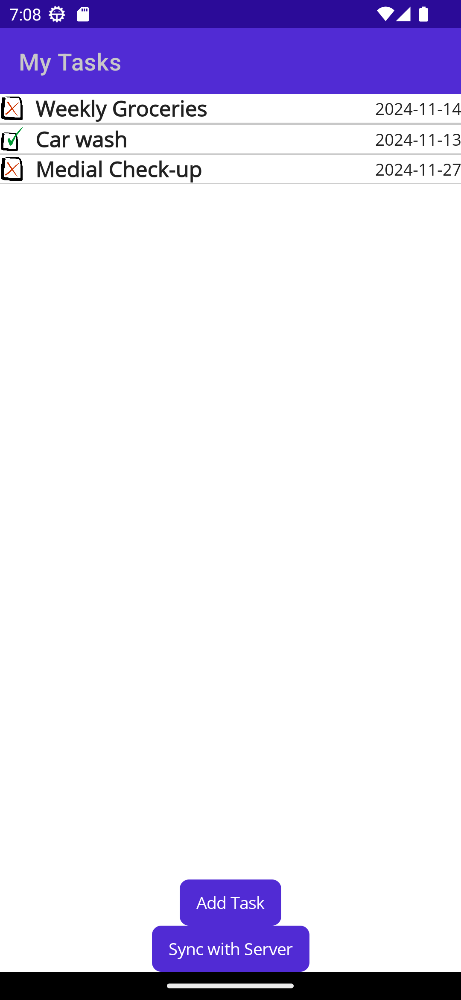
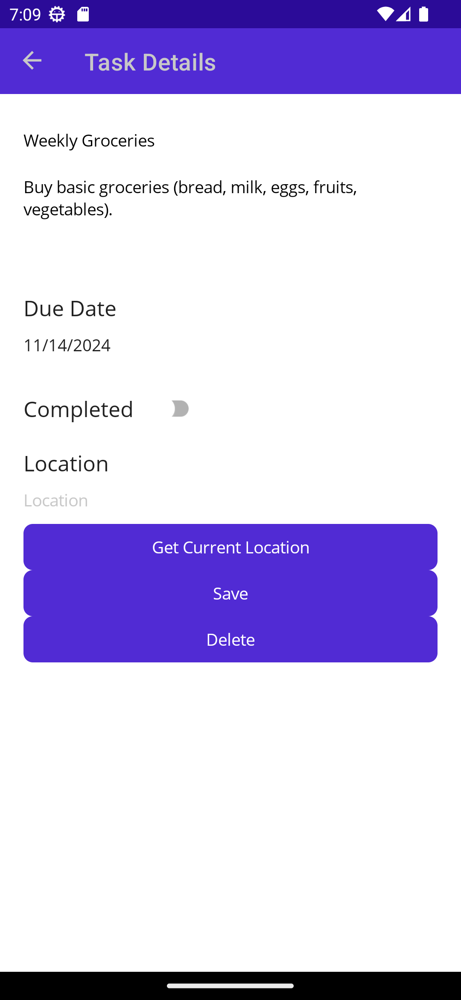

# Secure Task Manager

## Table of Contents
1. [Project Overview](#project-overview)
2. [Features](#features)
3. [Technologies Used](#technologies-used)
4. [Installation and Setup](#installation-and-setup)
5. [Project Structure](#project-structure)
6. [API Endpoints](#api-endpoints)
7. [Security Measures](#security-measures)
8. [Running the Application](#running-the-application)
9. [Simulating a Clickjacking Attack](#simulating-a-clickjacking-attack)
10. [Contributing](#contributing)
11. [License](#license)

---

## Project Overview

The **Secure Task Manager** is a mobile application with a secure backend, designed to help users manage tasks with features like due dates, location-based task tracking, and synchronization. The application prioritizes security with encrypted local storage, token-based authentication, and protections against clickjacking and other attacks.

---

## Gallery

|  |  |
|:-----------------------------------------:|:-----------------------------------------:|

---

## Features

- **User Authentication**: Secure user registration and login with JWT-based authentication.
- **Task Management**: Add, update, delete, and sync tasks with details like title, description, due date, location, and completion status.
- **Location Integration**: Fetch and store task location.
- **Data Encryption**: Secure data storage with AES encryption.
- **Backend Security**: Protection against clickjacking and token-based API access control.
- **Task Synchronization**: Sync tasks between local storage and the server.

---

## Technologies Used

- **Mobile App**: .NET MAUI (cross-platform app development)
- **Backend**: Flask (Python)
- **Database**: SQLite (local and backend)
- **Security**: JWT for authentication, AES for local storage encryption, CORS and clickjacking protections

---

## Installation and Setup

### Prerequisites

- **Mobile App:** .NET MAUI for mobile app development (requires .NET 6)
- **Backend:** Flask (Python 3.11.10) and other Python dependencies from `requirements.txt`
- `ngrok` for public URL tunneling

### Step 1: Clone the Repository

```bash
git clone https://github.com/your-username/secure-task-manager
cd secure-task-manager
```

### Step 2: Install Python Dependencies

Navigate to the backend folder and install dependencies:

```bash
pip install -r requirements.txt
```

### Step 3: Run ngrok for Tunneling

The backend uses ```ngrok``` for secure, temporary public access. Run the following to start ngrok:

```bash
python start_ngrok.py
```

The generated public URL is saved to ```ngrok_url.txt``` and automatically loaded by the mobile app.

### Step 4: Start the Backend Server

Run the backend server with Flask:

```bash
python app.py
```

### Step 5: Configure and Run the Mobile App

Ensure the API base URL is set in the mobile app (```App.cs```). Open the project in Visual Studio, then build and deploy to your preferred mobile platform (iOS, Android, or Windows).

---

## Project Structure

```bash
secure-task-manager
├── Mobile App (secure-task-manager-app)
│   ├── Converters          # Custom converters for UI data handling
│   ├── Models              # Data models like Task and User
│   ├── Services            # SQLite, API, and Secure Token Storage services
│   ├── Views               # UI views (Login, Register, Task Details)
│   └── App.xaml            # Application-wide resources and settings
└── Backend (secure-task-sync-api)
    ├── app.py              # Flask main application
    ├── models.py           # SQLAlchemy models for User and Task
    ├── auth.py             # Authentication routes
    ├── tasks_api.py        # Task management routes
    ├── config.py           # Application configuration (e.g., secret keys)
    ├── limiter_config.py   # Rate limiter configuration
    ├── requirements.txt    # Python dependencies
    ├── start_ngrok.py      # Ngrok script for secure tunneling
    └── templates           # HTML templates for clickjacking and registration
```

---

## API Endpoints

### Authentication

- **POST /auth/register**: Register a new user

- **POST /login**: Login and retrieve JWT token

### Task Management

- **GET /tasks**: Retrieve all tasks for the authenticated user

- **POST /tasks**: Add a new task

- **PUT /tasks/<task_id>**: Update an existing task

- **DELETE /tasks/<task_id>**: Delete a task

### Security Measures
|  |
|:-----------------------------------------:|

- **JWT Authentication**: Tokens used for all API requests after login.
- **Data Encryption**: AES encryption for local storage of sensitive data.
- **Clickjacking Protection**: CSP headers and JavaScript frame blocking.
- **Overlay Protection:** The app on MacCatalyst, iOS and Android detects potential overlay attacks (e.g., unauthorized overlays) and responds by showing a blank screen or a message indicating inactivity.
- **Rate Limiting**: Restrict the number of requests to prevent abuse.
- **CORS Policies**: Only allow specific origins.

---

---

## Running the Application
1. **Start Ngrok**: Run ```start_ngrok.py``` to generate a secure URL.
2. **Launch Flask Server**: Run ```app.py``` for the backend.
3. **Build and Run Mobile App**: Deploy the mobile app via Visual Studio.

## Simulating a Clickjacking Attack

To simulate a clickjacking attack, follow these steps. This setup will temporarily disable the clickjacking protections and redirect users to a crafted clickjacking page.

1. **Disable Clickjacking Protection with Automatic Redirect**:
   - In the backend, you can disable clickjacking protection temporarily using the `/toggle_clickjacking_protection` endpoint.
   - When protections are disabled, the backend will automatically redirect any user trying to access `/register_form` to the `clickjacking_attack.html` page, simulating a proxy bypass.

2. **Test Secondary Protection**:
   - The backend also includes a secondary JavaScript-based clickjacking protection mechanism, which can be toggled with the `/toggle_js_clickjacking_protection` endpoint.
   - With this protection disabled, visiting the `clickjacking_attack.html` page will allow it to load the registration form within an `iframe` without interference.
   - However, when the JavaScript protection is enabled, any attempt to access the registration page through an embedded `iframe` will immediately redirect the user to the real registration page, preventing the page from being loaded inside the attacker’s iframe.

3. **Open the Attack Page**:
   - The `clickjacking_attack.html` file, located in the repository, contains an `iframe` overlaying the registration page with nearly full transparency, allowing a user to unknowingly interact with the embedded page.
   - Simply attempting to access `/register_form` with protections disabled will result in receiving the attacker’s page (`clickjacking_attack.html`) instead. We assume that with protections off, the server proxy has also been compromised and redirects any requests to `/register_form` to the attack page.
   - Serve this `clickjacking_attack.html` file locally and open it in a browser to test how it can load and overlay the registration page. With both clickjacking protections disabled, clicking any fake button should trigger actions on the `iframe` page below it.

4. **Re-enable Protections**:
   - After testing, re-enable clickjacking protection by sending another `POST` request to `/toggle_clickjacking_protection` and `/toggle_js_clickjacking_protection`. The backend will then stop redirecting users and reapply all clickjacking protections to the registration page.

**Note**: Clickjacking attacks are a significant security threat, and this simulation should only be done in a secure environment to verify application resilience.

---

## Contributors

- Natalia Brzezińska
- Rafał Gajos

## License

This project is proprietary software.
© 2024 Natalia Brzezińska, Rafał Gajos
All Rights Reserved.

This repository is provided for viewing purposes only. Permission is not granted to copy, use, modify, or distribute the code in any form, including derivative works, without the prior written consent of the authors.
